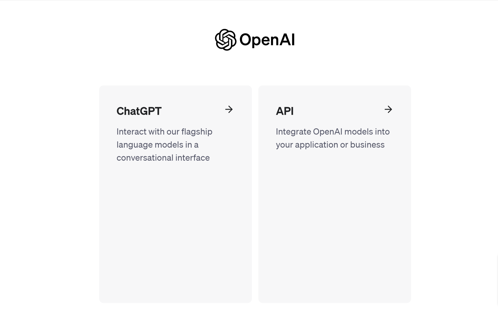
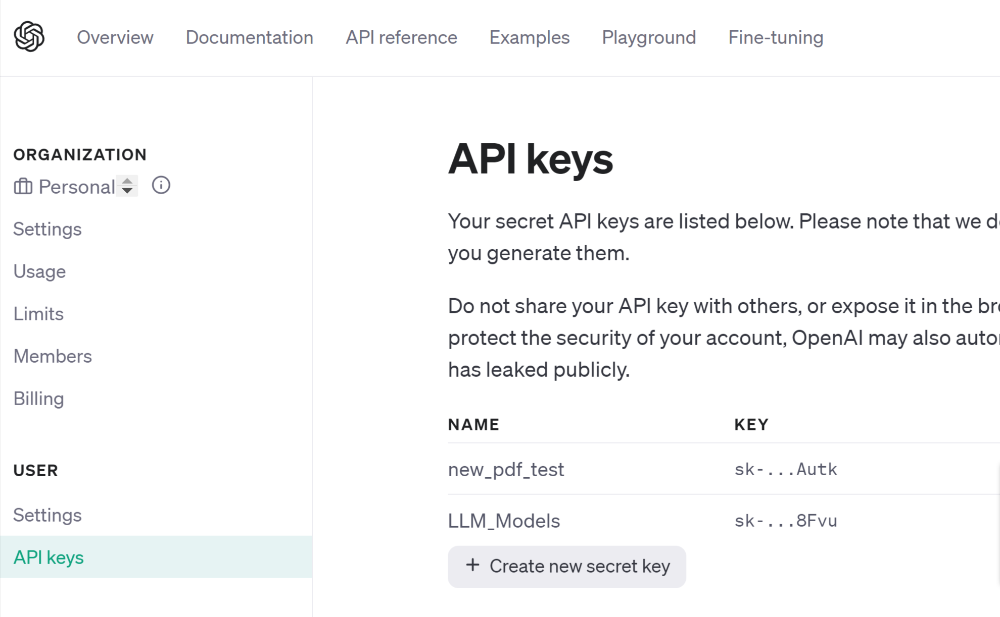
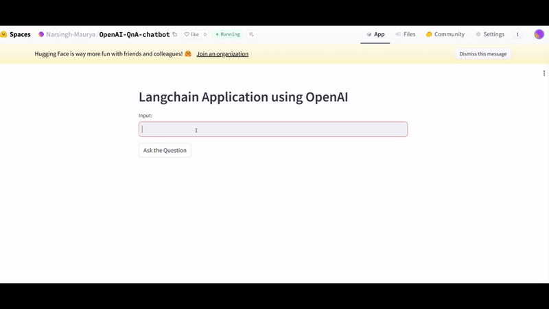

# END to End LLM and LangChain Project

### Step1: Create a virtual envirnonment and activate the venv

- create a venv with commond below:

```
conda create -p LLM python==3.9 -y
```

- activate the environment using commond below:

```
conda activate venv\
```

### Step2: create a `requirements.txt` file and install it

- write the libraries in this file that will be needed and can be installed altogether

- In our case I will write `langchain` and `openai` as of now and install it using below commond (don't forgot to save the file)

```
pip install -r requirements.txt
```

- After this installation we will be required to install `ipykernel` to run our jupyter notebook in this venv(seperatelly installing this bcz we are not going to intall this in the deployment environment)

```
pip install ipykernel
```

- Create a file `.env` where my Open api key can be written and we can use it by using `load enviroment variable function`
whenever it will be required.

- create a file as `langchain.ipynb`, this is basically our notebook where we test our code.

## Step3: Create own OpenAPI key

- go to the page `https://platform.openai.com/login`
- login or signup with your Contact and Email_ID
- Go to API 

- Go to your profile and select `view API key` from drop down
- click on `create new secret key` and name it or not and copy the key and save it somewhere. So that can be find next time when required.


### Using Hugging face

- Go to huggingface

- create account and login or signup
- verify email first and then go to `settings` and `access tokens`
- Create new token and copy it.

## APP DEMO
