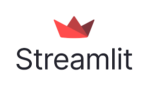
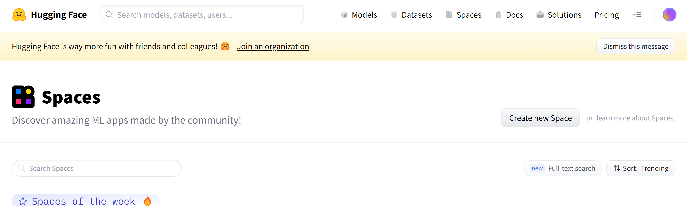
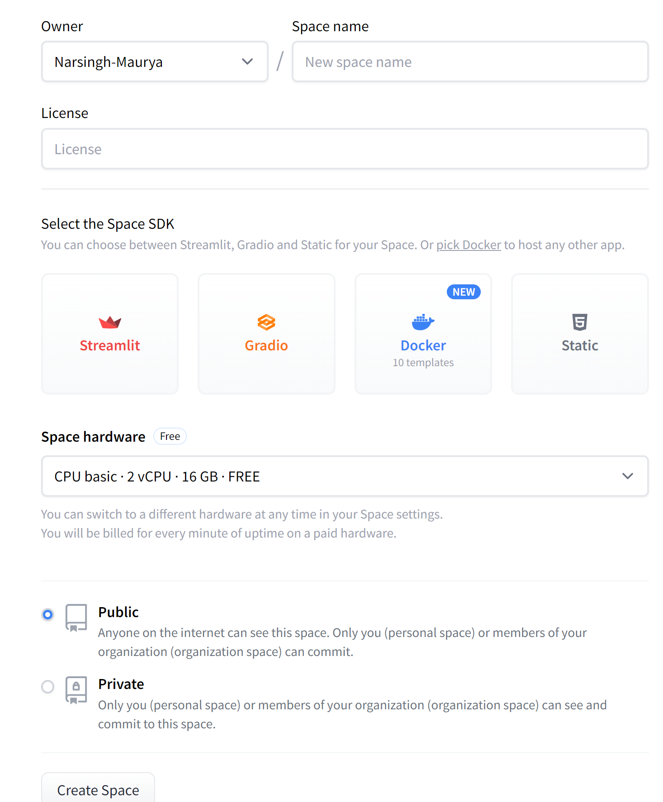
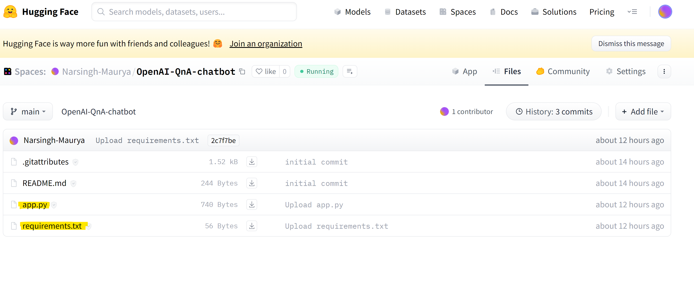
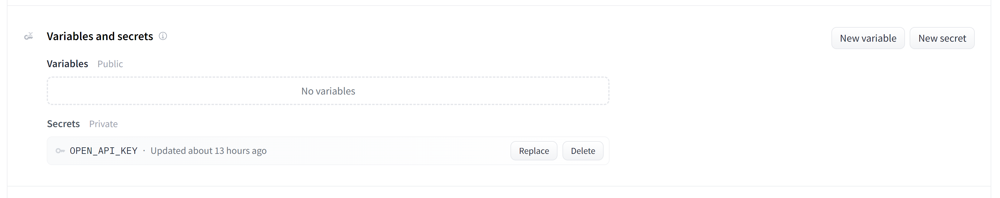

# END to End LLM and LangChain Project  :tada: :tada: :tada:

  <a href="https://platform.openai.com"><a href="https://huggingface.co/"><a href="https://www.langchain.com/"><a href="https://streamlit.io/"></a>


## Step1: Create a virtual environment and activate the venv

- create a venv with the command below:

```
conda create -p venv python==3.9 -y
```

- activate the environment using the command below:

```
conda activate venv\
```

## Step2: create a `requirements.txt` file and install it

- write the libraries in this file that will be needed and can be installed altogether

- In our case, I will write
```
langchain
openai
huggingface_hub
python-dotenv
Streamlight
```

   - as of now and install it using the below command (don't forget to save the file)

```
pip install -r requirements.txt
```

- After this installation, we will be required to install `ipykernel` to run our Jupyter notebook in this venv(separately installing this because we are not going to install this in the deployment environment)

```
pip install ipykernel
```

- Create a file `.env` where my Open API key can be written and we can use it by using `load_environ` variable function
whenever it will be required.


## Step3: Create your own OpenAPI key for OpenAPI and Huggingface models

- go to the page `https://platform.openai.com/login`
- login or signup with your Contact and Email_ID
- Go to API 
            
- Go to your profile and select `view API key` from drop-down
- click on `create new secret key` and name it or not, copy the key, and save it somewhere. So that can be found next time when required.
            

    ### Create Hugging face API(access tokens)
    
    - Go to `hugging face` website
    - create an account and log in or signup
    - verify email first and then go to `settings` and `access tokens`
    - Create a new token and copy it.

## Step4: Experiments 
- Create a python notebook file as `langchain.ipynb`, this is basically our notebook where we test our code and will be doing some experiments with both the LLM libraries.
-  Here I have covered some concepts:
     - Response from OpenAI
     - Response from huggingface_hub
     - Prompt Templates and LLM chains
     - Correct way of calling prompt templates
     - Combining Multiple Chains using simple sequential chain
     - Sequential chain
     - Chatmodels with ChatOpenAI
     - Prompt Template + LLM + Output Parsers

## Step5: Create a Streamlit Application
- Creating streamlit application so that it can be easily deployed on `Huggingface space`
- Create `app.py` file and write required code
- Run `app.py` file using below command:
```
streamlit run app.py
```
- Check here in localhost system that the application is working fine or not.
- If it is working then we can now deploy it to the `huggingface spaces`

## step6:Deployement
- I am going to deploy this application on `huggingface spaces`.
- Firstly we need to login [https://huggingface.co/](https://huggingface.co/) and go to the `spaces`.
- Click on `create new space`

    

- Now create a suited `space name` of the application as per format and select  `licence` and `UI framework` and `space hardware`.
- This could be a `public` space as well as `private`, so choose according to your need.

    

- There are multiple paid hardware also availble but for my this simple project I am choosing Free version of hardware.
- Click on create space. Once you created the space go to the `files` section of your space.
  
     

- Upload `requirements.txt` file and `app.py` file here
- It could be done through `cmd` but here  I am uplodaing manually.
- As the `requirements.txt` file gets uploaded it will start installing all the required libraries on the server.
- Now go to `settings` here next to the `files` and scroll up till the `Variables and secrets`.

     

- Here add your OpenAPI Key with same variable name being used to call in the `app.py` file.
- Now The application is deployed and you can go to `app`. Your application will start here as below


## APP DEMO  :+1:


  
